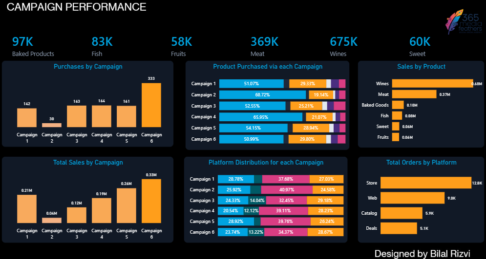
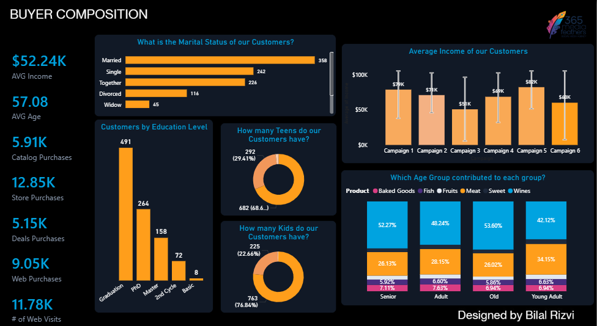
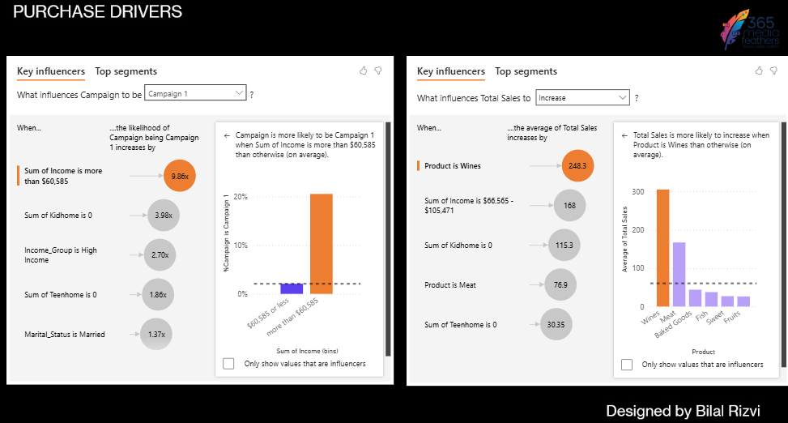

# Marketing Campaign Performance & Buyer Insights Dashboard

An interactive Power BI dashboard designed to evaluate marketing campaign efficiency, analyze customer demographics, and identify key drivers behind total sales. 

## 📊 Dashboard Views

### 1. Campaign Performance
Features deep dives into total purchases, product sales distribution, and platform channel acquisition across six major marketing campaigns.

### 2. Buyer Composition
An overview of customer demographics highlighting income brackets, education levels, marital status, and age group contribution to product categories.

### 3. Purchase Drivers
Utilizes advanced AI visuals (Key Influencers) to track what specific attributes—like income thresholds and household demographics—impact campaign success and higher sales volumes.

## 🛠️ Tech Stack & Tools Used
* **Business Intelligence:** Power BI Desktop
* **Data Modeling:** Star Schema (Fact and Dimension tables)
* **UI/UX Design:** Custom canvas backgrounds built via PowerPoint for a polished, modern dark-themed executive layout.

## 📈 Key Insights Addressed
* **Campaign Impact:** Identified which specific campaigns yielded the highest return on sales volume versus overall order counts.
* **Target Audience:** Segmented the core buyer persona (average age, income tier, and education background) driving the bulk of web and store revenue.
* **Behavioral Analysis:** Outlined the distinct impact of household dependencies (kids/teens at home) on buyer purchase frequencies.

## 📂 How to View the Project
1. Download the `.pbix` file from this repository.
2. Open it using **Power BI Desktop**.
3. (Optional) Explore the raw data(csv) file.
